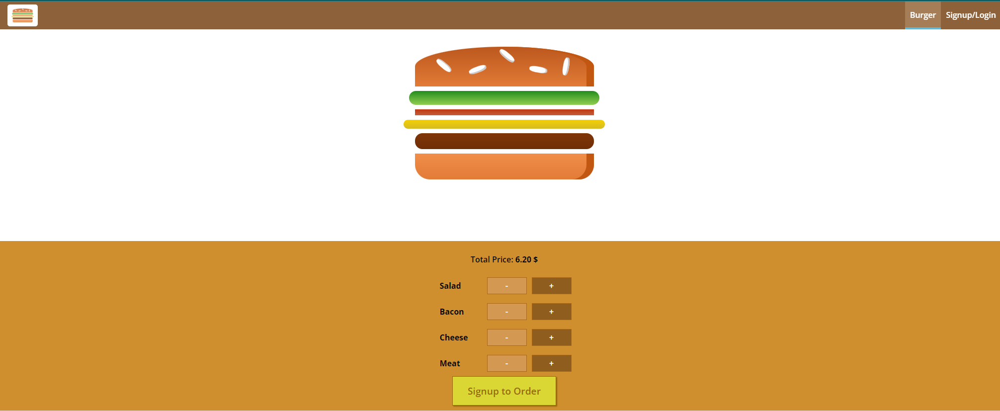

# Burger Builder

[](https://app.netlify.com/sites/burgerbuilder14/deploys)

Burger Builder is an App that allows you to build your own choice of burger then fill a form of your address details to deliver this burger to you. It depends on the API of Firebase website.

You can view the App from [here](https://burgerbuilder14.netlify.app/)

 

## Demo

https://user-images.githubusercontent.com/69651552/212470104-533abb08-94bf-417c-805b-566eacb5cd40.mp4

## Instructions, Building & Get Started

    - 1- Fork, clone or download this repository to your local machine.
    - 2- Navigate to the specific App folder you need to test. [e.g: hooks_burger_builder]
    - 2- Be sure that you install the [Node.js](https://nodejs.org/en/) environment in your machine.
    - 3- Open your terminal and be sure that you are inside the correct destination of the App, while you must be in the same path of the package.json file.
    - 4- inside your terminal run these commands:-
    
        * to install dependencies.
        ```
        npm install
        ```
        * to start the server.
        ```
        npm start
        ```
        * to build the App in production mode.
        ```
        npm build
        ```
    - 5- Once the App server is running visit (localhost:3000) in the browser to view the App and now you can treat with it as shown above in the Demo.
    - 6- You can also see a live preview of the App from this link (https://burgerbuilder14.netlify.app/)

## Built With

* HTML
* CSS
* JS

## Libraries & Packages

* [PropTypes](https://www.npmjs.com/package/prop-types)
* [Redux Thunk](https://www.npmjs.com/package/redux-thunk)
* [React Router](https://www.npmjs.com/package/react-router)
* [React Router Dom](https://www.npmjs.com/package/react-router-dom)
* [Axios](https://www.npmjs.com/package/axios)
* [Enzyme](https://www.npmjs.com/package/enzyme)

## Frameworks 

* [React.js](https://reactjs.org/) 
 
## API

* [Firebase](https://firebase.google.com/)

## Author

* [Mohamed Elhawary](https://www.linkedin.com/in/mohamed-elhawary14/)  

## Contact me through my social accounts

* Email: mohamed.k.elhawary@gmail.com
* [LinkedIn](https://www.linkedin.com/in/mohamed-elhawary14/)
* [Github](https://github.com/Mohamed-Elhawary)  
* [Behance](https://www.behance.net/mohamed-elhawary14)
* [Codepen](https://codepen.io/Mohamed-ElHawary) 


## Notices

- This Repo contains a practical project from Udemy Course [Maxmillian React Course – The Complete Guide (include Hooks, React Router, Redux)](https://www.udemy.com/course/react-the-complete-guide-incl-redux/)

- You can consider this Repo as a reference and a strong practical & revision to understand the working logic of `react`, `redux`, `react-redux` & middlwares like `redux-thunk` & `redux-saga` and how they interact with a react App. As this Repo contains 4 separate folders for the same project but each project covers one of the following: [react, hooks, redux & redux-saga]

- Repo folders are:-

#### [React](react_burger_builder)    
#### [React Hooks](hooks_burger_builder)
#### [Redux](redux_burger_builder)
#### [Redux Saga](redux_saga_burger_builder)

## Certificate

[Course Certificate](Certificate.pdf)

## License

Licensed under the [MIT License](LICENSE)
